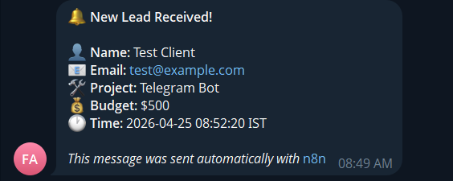

# n8n Webhook Templates

Reusable n8n workflows for capturing webhook events and routing them to Telegram or email without writing a custom backend.

This repo is aimed at freelancers, agencies, and small product teams that want production-ready lead capture automations they can import, configure, and ship quickly.

## What is included

| Workflow | File | Purpose |
| --- | --- | --- |
| Lead Capture -> Telegram | `workflows/01-lead-capture-telegram.json` | Sends instant Telegram alerts for new inbound leads |
| Contact Form -> Email | `workflows/02-contact-form-email.json` | Sends an admin email plus an automatic reply to the sender |

## Business value

- Replaces ad hoc form handling with a reusable workflow template.
- Helps respond faster to leads without maintaining a custom notification service.
- Works well for self-hosted n8n setups behind Cloudflare Tunnel or a reverse proxy.

## Repo structure

```text
workflows/   importable n8n workflow JSON files
docs/        screenshots and deployment notes
examples/    sample test commands
.env.example example environment variables
```

## Demo

When a lead webhook fires, the Telegram workflow sends a notification like this:

```text
New Lead Received!

Name: Test Client
Email: test@example.com
Project: Telegram Bot
Budget: $500
Time: 2026-04-25 08:52:20 IST
```



## Quick start

### Prerequisites

- n8n 1.x or later
- A Telegram bot token from [@BotFather](https://t.me/BotFather) for workflow 01
- Your Telegram chat ID from [@userinfobot](https://t.me/userinfobot)
- SMTP credentials configured in n8n for workflow 02

### Setup

1. Clone the repo.

```bash
git clone https://github.com/md-yusuf-f/n8n-webhook-templates.git
cd n8n-webhook-templates
```

2. Copy values from `.env.example` into your n8n environment or Docker setup.

3. Create the required n8n credentials.

- `Telegram API` credential named `Telegram Lead Bot`
- `SMTP` credential for outbound email

4. Import one of the workflow JSON files from `workflows/`.

5. Re-select the credential inside each imported node.

6. Activate the workflow and test the webhook endpoint.

### Test the Telegram workflow

```bash
bash examples/test-curl.sh https://your-n8n-domain
```

Or send a request manually:

```bash
curl -X POST https://your-n8n-domain/webhook/new-lead \
  -H "Content-Type: application/json" \
  -d '{
    "name": "Test Client",
    "email": "test@example.com",
    "project_type": "Telegram Bot",
    "budget": "$500"
  }'
```

## Workflow flow

```text
Webhook -> Normalize Fields -> Notification Node -> JSON Response
```

## Production notes

- Keep secrets in n8n credentials or environment variables, not inside workflow JSON.
- Restrict webhook exposure with Cloudflare Tunnel, a reverse proxy, or a webhook secret check.
- Use the setup guide in [docs/setup.md](docs/setup.md) for self-hosted deployment details.

## Public portfolio note

This repository contains template workflows only. Credential IDs inside the JSON files are placeholders and must be replaced in your own n8n instance after import.

## Contact

- GitHub: [md-yusuf-f](https://github.com/md-yusuf-f)
- LinkedIn: [Mohammed Yusuf](https://www.linkedin.com/in/yusuf1799/)
- Email: `mohammedyusuf1799@gmail.com`

## License

MIT. Use, modify, and ship these templates in commercial or personal projects.
